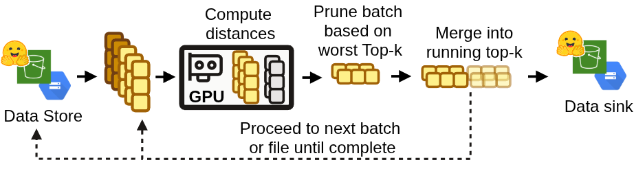

# Brute Force

`nova bf` computes exact k-nearest-neighbor results for a query set. These results provide ground truth for evaluating approximate vector search systems using metrics such as recall@k.

For distributed runs, workers independently scan corpus shards and produce partial top-K results, which are merged into a global top-K.

{ .center width="600" }

## Config

```yaml
corpus:
  path: s3://my-bucket/dataset/model
  dense_column: dense_embedding

queries:
  path: s3://my-bucket/dataset/model/queries.parquet
  dense_column: dense_embedding
  payload_fields: [text]

output:
  path: s3://my-bucket/dataset/model/eval

params:
  io_workers: 16

searches:
  - name: dense_all
    vector_type: dense
    metric: cosine
    k: 1000
```

Each entry in `searches` defines an independent search. Multiple searches in the same run share corpus reads when possible.

Environment variables support `${VAR}` and `${VAR:-default}` expansion.

## Vector Types

- `dense`: `list<float32>` using cosine, dot product, or Euclidean distance.
- `sparse`: sparse index/value vectors using dot product or cosine.
- `multivector`: token-level vectors scored using ColBERT-style MaxSim.

## Filters

A search's `filter` restricts which corpus rows are eligible. Filters follow the Qdrant-style `must` (AND), `should` (OR), and `must_not` structure.

```yaml
filter:
  must:
    - field: language
      match: eng
  should:
    - field: source
      match: [wiki, news]
  must_not:
    - field: cost
      range: {gte: 10}
```

Each condition uses one filter type. Conditions cannot be nested, and null values never match.

### `match`

Matches exact values; a list matches any value.

```yaml
- field: language
  match: eng
- field: category_id
  match: [3, 7, 12]
```

### `range`

Supports any combination of `gt`, `gte`, `lt`, and `lte`.

```yaml
- field: cost
  range: {gte: 1, lt: 10}
```

For dates, list fields in `corpus.date_fields`. Bounds use RFC 3339 unless another format is specified.

```yaml
corpus:
  date_fields: {published_at: rfc3339, crawl_day: "%Y%m%d", ingested_at: epoch_s}

filter:
  must:
    - field: published_at
      range: {gte: "2013-01-01T00:00:00Z"}
```

### `match_text`

Matches rows containing every word in the phrase, in any order. Text is lowercased and tokenized like Qdrant's `word` tokenizer with `lowercase: true`; stemming and stopwords are not applied.

```yaml
- field: text
  match_text: chronic fatigue syndrome
```

### Per-query filters

`match_from_query`, `range_from_query`, and `match_text_from_query` take values from columns in the queries file, allowing each query to use its own restrictions.

```yaml
filter:
  must:
    - field: tenant_id
      match_from_query: tenant_id
    - field: cost
      range_from_query: {lt: max_budget}
    - field: title
      match_text_from_query: search_phrase
```

Static and per-query conditions can be mixed:

```yaml
should:
  - field: is_public
    match: true
  - field: tenant_id
    match_from_query: tenant_id
```

A `range_from_query` condition cannot also contain a literal bound; use separate conditions instead. Per-query date columns must be listed in `queries.date_fields`.

`match_from_query` and `range_from_query` run on the GPU. `match_text_from_query` runs on the CPU and builds a `queries × rows` mask per file, so it can be expensive for large query sets.

## Running

Single GPU:

```bash
nova bf compute my_eval.yaml
```

Distributed:

```bash
nova bf compute my_eval.yaml --num-jobs 8 --job-rank $RANK
nova bf merge my_eval.yaml
```

`nova dist bf` can provision and execute distributed workers automatically.

`--max-files N` is useful for performance testing, but its output is not valid full-corpus ground truth.

## Output

Each search produces:

```text
{output.path}/bf_<queries-stem>_<name>_k<K>.parquet
```

Important columns are:

| Column | Description |
|---|---|
| `query_id` | Query identifier |
| `hit_ids` | Top-K corpus IDs, best first |
| `hit_scores` | Corresponding scores |

A manifest is also written with configuration, hardware, code version, and timing information.

## IDs and Ties

`hit_ids` must match the point IDs used when loading the corpus into the vector database.

By default, Nova derives deterministic IDs from file paths and row numbers. An existing ID column can instead be specified with `corpus.id_column`.

Exact-score ties are resolved deterministically using either corpus order (`ordinal`, default) or `corpus.id_column`.

## Performance

Brute-force execution overlaps corpus I/O, CPU decoding, and GPU scoring. For many workloads, reading and decoding are the primary bottlenecks.

Useful tuning options include:

- `io_thread_count`: S3 fetch concurrency.
- `cpu_thread_count`: decoding and filtering threads.
- `io_workers`: concurrently processed files.
- `dense_batch_size` / `sparse_batch_size`: bound GPU memory usage.
- `two_pass`: safely skips candidates that cannot enter the top-K.
- `allow_tf32`: enables faster matmuls but sacrifices exact float32 scoring.

For large AWS runs, prefer high-vCPU GPU instances in the same region as the dataset.